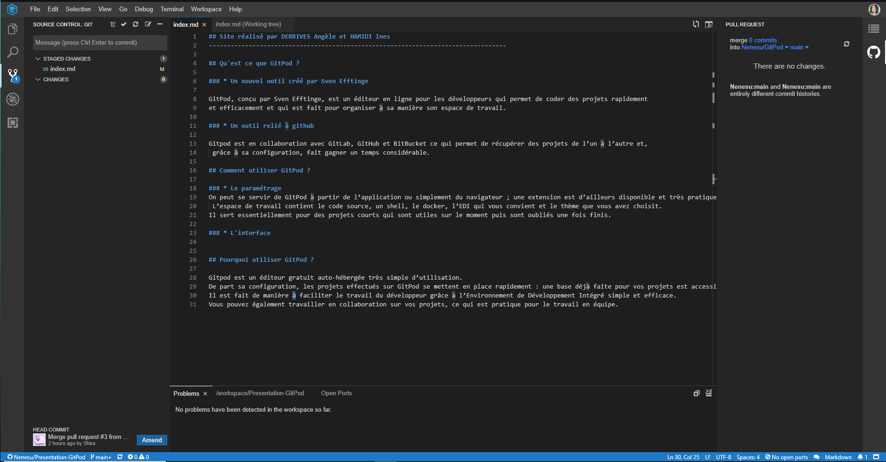

<head>
    <link rel="shortcut icon" type="image/png" href="/favicon.png">
</head>

## Site réalisé par DERRIVES Angèle et HAMIDI Ines
----------------------------------------------------------------------------------

## Qu'est ce que GitPod ?

### * Un nouvel outil créé par Sven Efftinge

GitPod, conçu par Sven Efftinge, est un éditeur en ligne pour les développeurs qui permet de coder des projets rapidement et efficacement 
et qui est fait pour organiser à sa manière son espace de travail.

### * Un outil relié à github

Gitpod est en collaboration avec GitLab, GitHub et BitBucket ce qui permet de récupérer des projets de l’un à l’autre et, 
grâce à sa configuration, fait gagner un temps considérable.

## Comment utiliser GitPod ?

### * Le paramétrage  

Contrary to popular belief, Lorem Ipsum is not simply random text. 
It has roots in a piece of classical Latin literature from 45 BC, making it over 2000 years old. 
Richard McClintock, a Latin professor at Hampden-Sydney College in Virginia, 
looked up one of the more obscure Latin words, consectetur, from a Lorem Ipsum passage, 

### * L'interface

## Pourquoi utiliser GitPod ?

Gitpod est un éditeur gratuit auto-hébergée très simple d’utilisation. 
Il a une [documentation](https://www.gitpod.io/docs/) très claire et utile pour découvrir et utiliser cet outil.
De part sa configuration, les projets effectués sur GitPod se mettent en place rapidement : une base déjà faite pour vos projets est accessible. 
Il est fait de manière à faciliter le travail du développeur grâce à l’Environnement de Développement Intégré simple et efficace. 
Vous pouvez également travailler en collaboration sur vos projets, ce qui est pratique pour le travail en équipe.